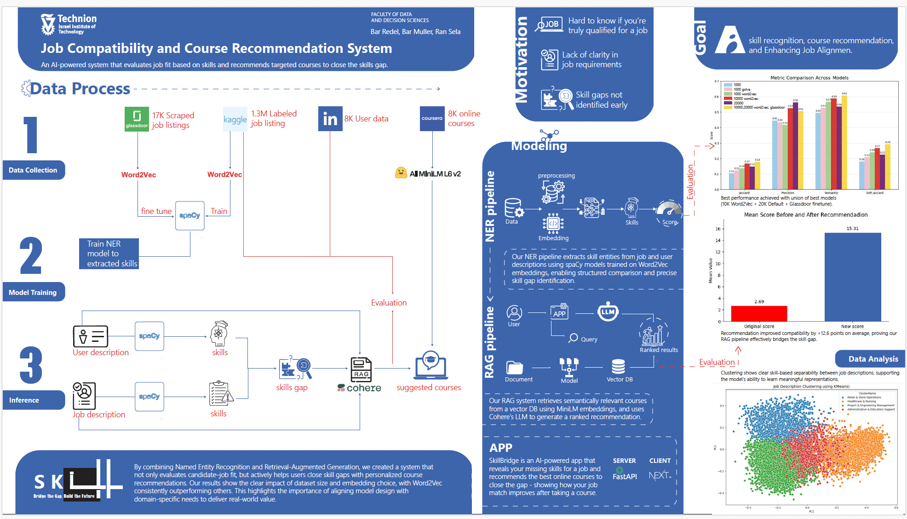

# Skill Bridge

## Credits

- All models themselves, and ML flow (including NLP, RAG, and similarity logic) were written by [Ran Sela](https://github.com/RanSela-033), [Bar Muller](https://github.com/Barm2), and [Bar Redel](https://github.com/BarRedel).

See the original jupiter notebooks for the models [in this repository](https://github.com/RanSela-033/Skill-Bridge_AI_tool).

- Full-stack development, UI/UX, and DevOps were made by [Nitzan Papini](https://github.com/nitzanpap).

## Description

🎯 Skill Bridge is a recommendation engine that identifies skill gaps between job seekers and job requirements, then suggests targeted upskilling courses to improve job match scores. By bridging the gap between user skills and job requirements, we help candidates become more competitive for their desired positions.

## Flow Diagram



## Features

- 📄 **Skill Extraction**: Automatically extract required skills from job descriptions using NER (Named Entity Recognition)
- 👤 **Profile Analysis**: Process user profiles to identify existing skills and competencies
- 📚 **Job Matching**: Match users to relevant jobs based on skill compatibility using various metrics
- 🔍 **Gap Analysis**: Quantify and visualize skill gaps between candidates and job requirements
- 🧠 **Semantic Matching**: Compare skills semantically using state-of-the-art sentence transformers (e.g., "ML" matches with "Machine Learning")
- 🎯 **Match Scoring**: Calculate an overall match score between resume and job description to help candidates assess their fit
- 📘 **Course Recommendations**: Suggest the most relevant courses to acquire missing skills with potential score improvement metrics

## Tech Stack

### Frontend

- **Framework**: Next.js 15+ (React framework)
- **UI Libraries**:
  - Tailwind CSS for styling
  - Shadcn UI for component library
  - Lucide React for icons
- **Language**: TypeScript
- **State Management**: React Context API
- **API Integration**: Fetch API
- **Runtime & Package Manager**: Bun
- **Code Quality**: Biome (linting + formatting)
- **Deployment**: Vercel

### Backend

- **Framework**: FastAPI (Python web framework)
- **Machine Learning**:
  - spaCy for NER models
  - sentence-transformers for semantic matching
  - scikit-learn for similarity metrics
- **Language**: Python 3.10+
- **Containerization**: Docker
- **API Documentation**: Swagger UI / ReDoc (auto-generated)
- **Dependency Management**: uv (faster and more reliable than pip)
- **Development Tools**:
  - Black for code formatting
  - Flake8 for linting
  - mypy for type checking

### Development Environment

- **Version Control**: Git
- **Runtime**: Bun (frontend), Python 3.10+ (backend)
- **Environment Management**: Python virtual environments and .env files
- **Container Orchestration**: Docker Compose for consistent development and deployment environments

## Core Components

- Advanced NER pipeline for skill identification
- Semantic matching using sentence transformers
- Comprehensive evaluation tools and metrics
- Course recommendation engine with score improvement calculations
- Modern, responsive UI with light/dark mode support

## Installation & Setup

### Prerequisites

- Docker (required for deployment)
- **Supported Platforms**: Any platform that can run Docker
- **API Keys** (required):
  - [Pinecone](https://www.pinecone.io/) API key for course vector storage
  - [Cohere](https://cohere.com/) API key for LLM-based recommendations

> **Note**: The application is designed to run exclusively through Docker to ensure consistent environments across development and production.

#### Installing Docker

Docker allows you to run applications in containers, making setup much easier:

1. Download and install Docker Desktop from [https://www.docker.com/products/docker-desktop/](https://www.docker.com/products/docker-desktop/)
2. Follow the installation wizard instructions for your operating system
3. After installation, start Docker Desktop
4. Verify installation by running `docker --version` in your terminal/command prompt

### Docker Setup (Only Supported Method)

1. Clone the repository (if not done already)

    ```bash
    git clone https://github.com/yourusername/skill-bridge.git
    cd skill-bridge
    ```

2. Configure environment variables

    Copy the example env files and add your API keys:

    ```bash
    cp backend/.env.example backend/.env
    ```

    Edit `backend/.env` and set your API keys:

    - `PINECONE_API_KEY` (required) - Get one at [pinecone.io](https://www.pinecone.io/)
    - `COHERE_API_KEY` (required) - Get one at [cohere.com](https://cohere.com/)

3. Build and run with Docker Compose

    ```bash
    # Build and start both backend and frontend services
    docker-compose up --build

    # Or run in detached mode
    docker-compose up -d --build
    ```

    On first startup, the backend will automatically create and populate the Pinecone course index (~2 minutes). Subsequent startups skip this step.

The API will be available at <http://localhost:8000> with documentation at <http://localhost:8000/docs>
The frontend application will be available at <http://localhost:3000>

### Security

The application includes several security measures:

- **Input validation**: Request payloads are bounded (50K chars max for text fields)
- **Rate limiting**: API endpoints are rate-limited (10 requests/minute per IP)
- **CORS**: Configured with explicit origin allowlists (no wildcard + credentials)
- **Non-root containers**: Both Docker containers run as non-root users
- **Error sanitization**: Internal error details are never exposed to clients

## Deployment

### Client Deployment

- **Vercel**: The frontend is deployed on Vercel for easy hosting and scaling. It automatically builds and deploys from the main branch.

### Backend Deployment

- **Docker**: The backend is containerized using Docker, allowing for easy deployment on any platform that supports Docker:

    ```bash
    docker build -t skill-bridge-backend ./backend
    docker run -d -p 8000:8000 --env-file backend/.env skill-bridge-backend
    ```

#### Where to deploy

You can deploy the backend on any cloud provider that supports Docker build/compose, but these are the already configured options:

1. **Railway**: A platform that allows you to deploy Docker containers easily. You can set up a new project, connect your GitHub repository, and it will automatically build and deploy your backend.

2. **Locally with ngrok**: If you want to test locally, you can use ngrok to expose your local backend server to the internet. This is useful for development and testing purposes.

    ```bash
    # Install ngrok if not already installed
    npm install -g ngrok

    # Start ngrok to expose your local backend
    ngrok http 8000

    # Or via your persistent ngrok domain
    ngrok http --url=<your-ngrok-domain>.ngrok-free.app 8000
    ```

Whatever method you choose, ensure that the backend URL is correctly set in your frontend application configuration (In Vercel's environment variables).

## Usage

The application provides a simple web interface where you can:

1. Paste your resume text
2. Paste a job description
3. Adjust the similarity threshold for matching
4. Get a comprehensive analysis including:
   - Overall match score
   - Matched skills
   - Missing skills
   - Detailed similarity breakdown for each skill
   - Course recommendations to bridge your skill gap
   - Score improvement predictions for each recommended course

## Technical Architecture

- **Backend**: FastAPI server with spaCy NER models and sentence-transformers for semantic similarity
- **Frontend**: Next.js application with React, Tailwind CSS, and Shadcn UI components
- **API**: RESTful endpoints for skill extraction, comparison, and course recommendations

## Impact

This project directly addresses workforce development challenges by:

- Providing clear pathways for career advancement through targeted course recommendations
- Optimizing training and education investments by focusing on high-impact skills
- Reducing skill mismatches in the job market
- Empowering users with actionable insights for professional development
- Quantifying potential improvements in job match scores through recommended courses
